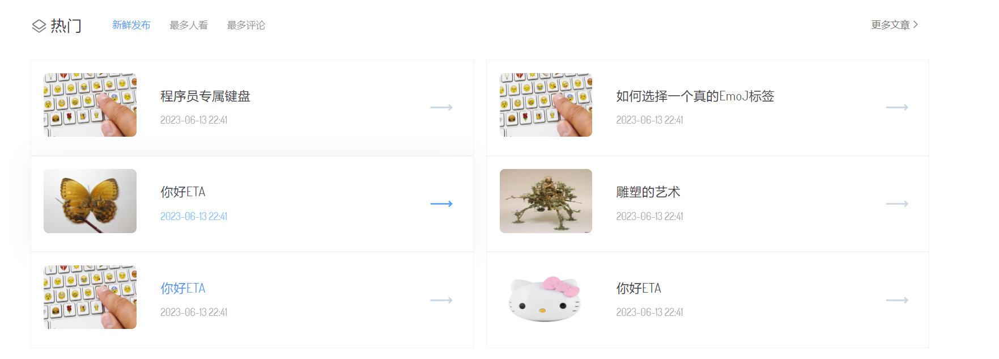

# Eta

- **Eta：**
  - `Eta`是为了 [Theta](https://github.com/zBo1997/Theta/tree/v1.0.2) 项目的落地的产物
     ,为了开发人员不再关注中间的是的实现细节，更加方便的使用中间，加快开发进度，省去很多中间使用学习过程
  - `Eta`是一个建议的BBS+CMS系统的结合，涵盖了二者共有的核心功能
  - 项目目的是为了学习最新的技术采用目前相对较新的JDK LTS 版本：JDK11，新特性加快开发速度
  - 

|  项目目   | 项目当前版本号 |
|:---------:|:--------:|
|     eta-dependencies-parent     | 父项目（版本控制） | 
|     eta-information-server      | 对外提供服务（服务项目）   |
|     eta-information-oauth       | 认证服务（服务项目）   |
|     eta-information-member      | 对外提供服务（服务项目）   |
|     eta-information-admin       | 管理后台项目（服务项目）   |
|     eta-information-pay         | 支付服务（服务项目）   |

- **项目演示：**
- 首页轮播图

- 文章详情

- 文章列表

- 页面大小自适应
